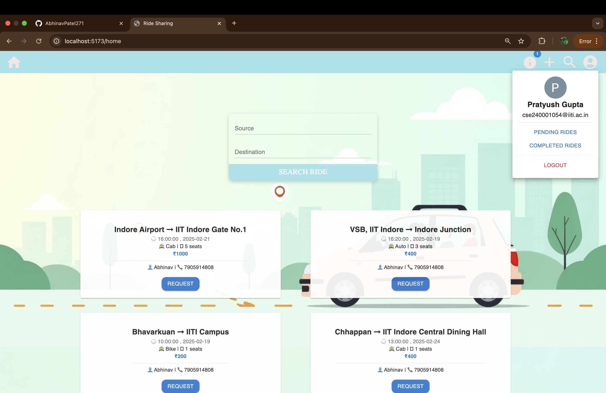
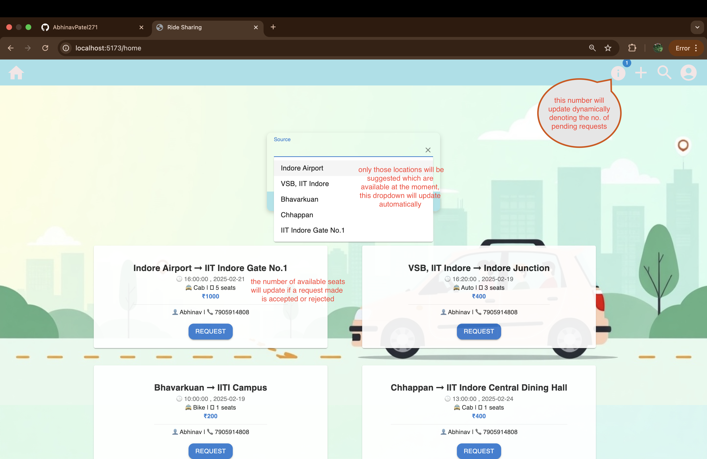
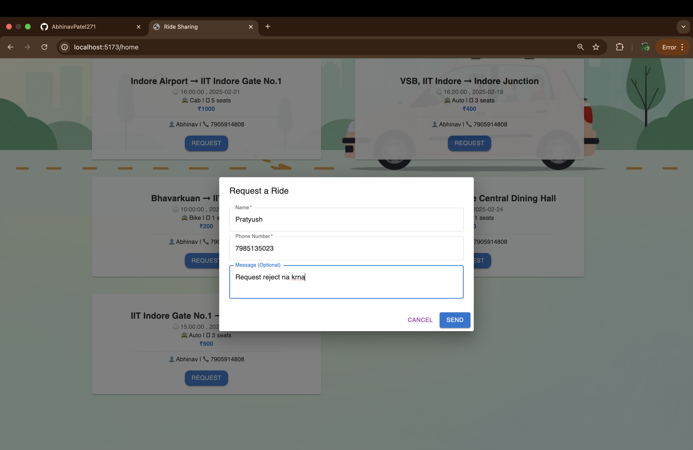
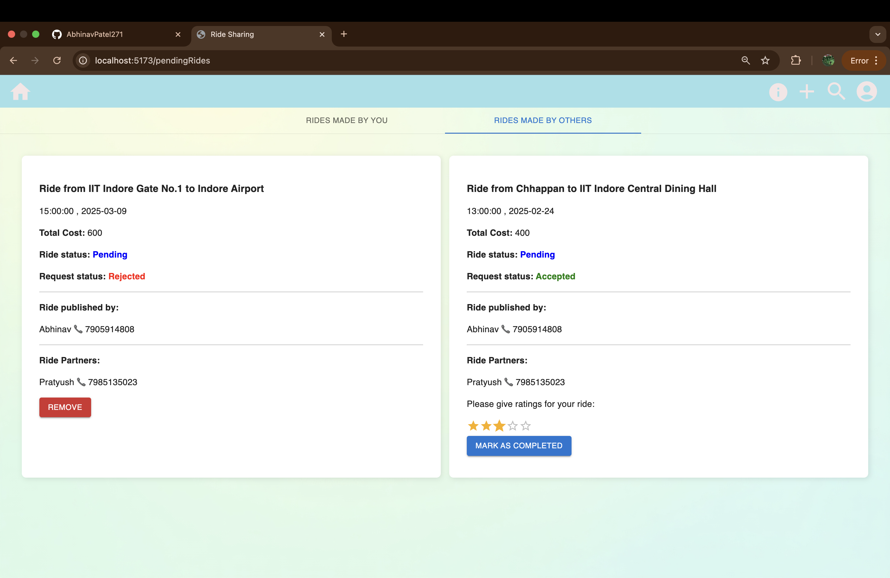
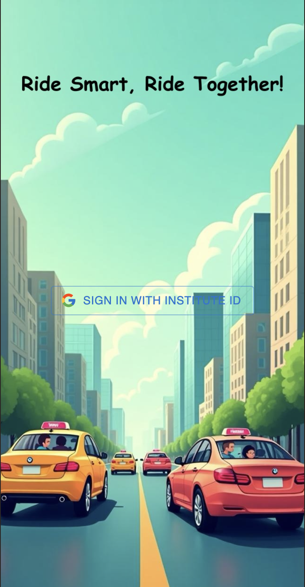
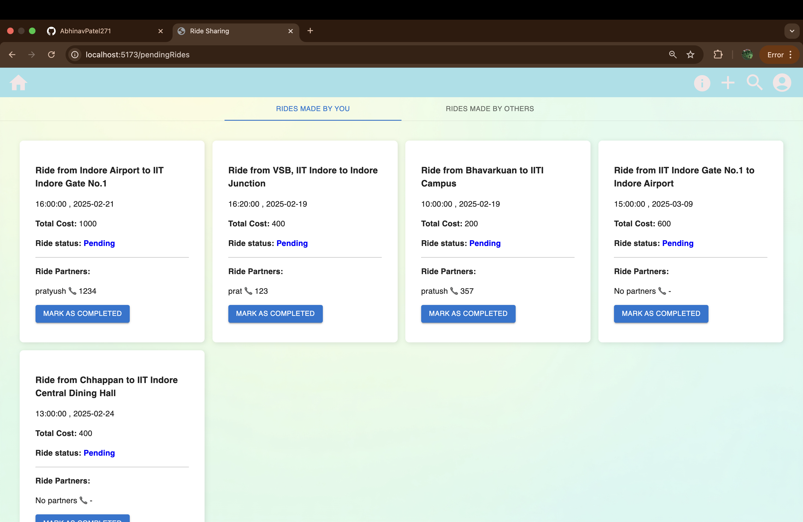
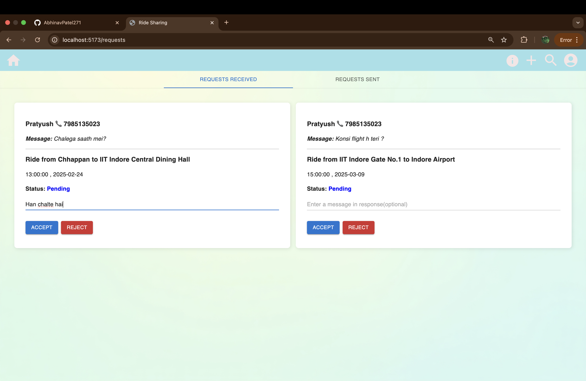
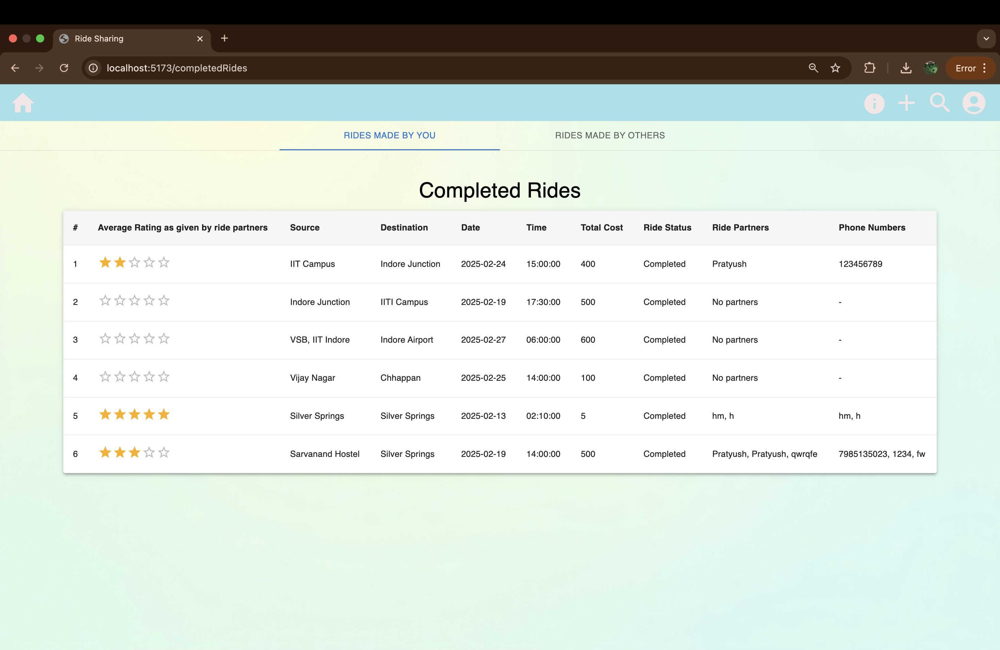
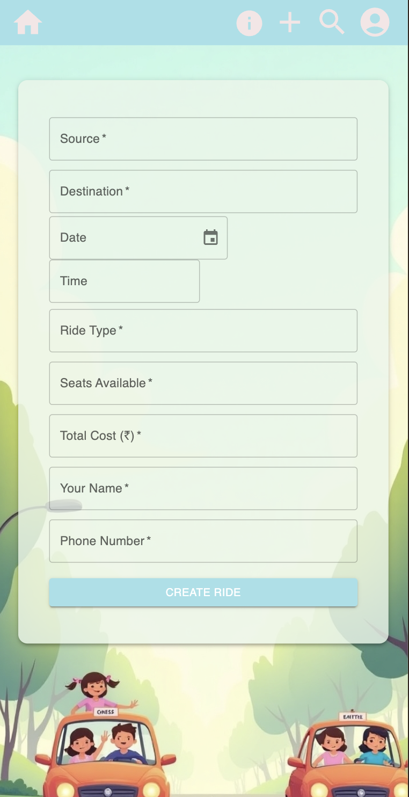

# Ride Sharing Website

**Troubleshooting -**
1. I have used firebase for authentication which sometimes fails on local network, 
   in this case try using a VPN for login.
2. Sometimes on few of the VPN services, render(on which my postgres database is hosted) doesn't work , so after login(using VPN) , turn off the VPN and restart the backend again 
   by running node index.js in the ride_backend directory.  

<p>I have done and submitted and all the required files within the actual deadline of the PS, 
   I have just added few comments(for explanation) in the files and updated the readme a little after the deadline.
   So, please consider this 🙏.</p>

### Steps to Run Locally
1. **Clone the repository**
   ```bash
   git clone https://github.com/AbhinavPatel271/Ride_Sharing_website.git
   cd Ride_Sharing_website
   ```
2. **Setup Backend before Frontend**
   ```bash
   cd ride_backend
   npm install
   node index.js
   ```
3. **Setup Frontend - Open new terminal**
   ```bash
   cd ride_frontend
   npm install
   npm run dev
   ```
## NOTE - 
Ensure that you are in ride_backend directory while running node index.js and 
you are in ride_frontend directory while running npm run dev

4. **Open the url in a web browser**
   ```bash
   http://localhost:5173/
   ```

## Project Overview
This is a ride-sharing platform exclusively for IIT Indore students. Users can sign in using their institute email ID (`@iiti.ac.in`) and either create rides or join available rides. The platform facilitates easy ride coordination, request handling, and feedback through ratings.

## Features
- **User Authentication**: Sign-in is restricted to IIT Indore students using their `@iiti.ac.in` email.
- **Create a Ride**: Users can create a ride by entering relevant details like source, destination, date, time, and available seats.
- **View Available Rides**: Users can browse all pending rides with at least one available seat.
- **Ride Requests**: Users can send and receive requests along with a mesaage for sharing rides.
- **Manage Requests**: Users can view sent and received requests and respond accordingly.
- **Repeated Requests**: If a user made a ride request to someone and the ride creator doesn't want to respond to the request(due to personal reasons), then the user cannot send the request again and again. 
- **Ride Search**: Search for rides based on source, destination, or both.
- **Pending Rides**: A dedicated page to manage pending rides, mark them as complete, and provide ratings.
- **Ride History**: Users can view their completed rides, see details of ride partners, and check an averaged rating based on feedback from all ride partners.

## Tech Stack
### Frontend
- **React.js**: For a dynamic and interactive UI.
- **Material UI**: For modern and responsive UI components.
- **Firebase**: For authentication of the users.

### Backend
- **Express.js**: Handles API requests and user authentication.

### Database
- **PostgreSQL**: Stores user data, ride details, and ride history. Hosted on Render.

 
<h1>Few screenshots are there in the <a href="screenshots" >screenshots</a> folder :<h1/>



<br/> <hr/>



<br/> <hr/>



<br/> <hr/>



<br/> <hr/>



<br/> <hr/>



<br/> <hr/>



<br/> <hr/>



<br/> <hr/>



 
